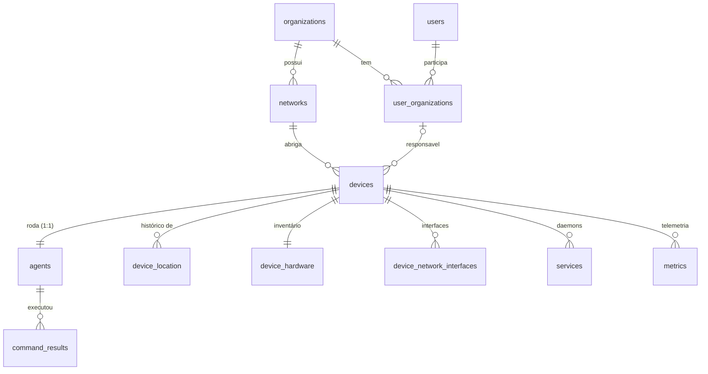

# Modelo de Dados — Argus

Referência do schema PostgreSQL após a separação **Agent × Device** (migrations V8/V9).
Fonte autoritativa: `server/src/main/resources/db/migration/`.

---

## Conceito central: Agent ≠ Device

O ponto que motivou a refatoração:

> O **agent** é o *software/implant* que roda numa máquina. O **device** é a máquina.
> Antes da V8 as duas coisas estavam fundidas na tabela `agents`, o que estava errado.

| | **Device** (a máquina) | **Agent** (o software) |
|---|---|---|
| O que é | host físico/virtual monitorado | binário que disca pro servidor via gRPC |
| Tempo de vida | longo — sobrevive a reinstalações | pode ser reinstalado / atualizado |
| Identidade | hardware, SO, rede, usuário do SO | `token_hash`, versão, conexão |
| Cardinalidade | 1 device | 1 agent ativo por device (`UNIQUE`) |

O contrato gRPC (`proto/argus.proto`) **não muda**: quem conecta continua se identificando
por `agent_id`. O servidor resolve `agent → device` na hora de persistir telemetria.

---

## Diagrama

---

## Tabelas

### `devices` — a máquina
Tudo que descreve o host. Criada na V8; perdeu `ip_address`/`mac_address` na V9.

| Coluna | Tipo | Nota |
|---|---|---|
| `id` | UUID PK | |
| `network_id` | UUID FK → `networks` | rede onde a máquina está |
| `user_organization_id` | UUID FK → `user_organizations` | responsável (nullable) |
| `hostname` | VARCHAR(255) | |
| `fqdn` | VARCHAR(255) | |
| `os` | VARCHAR(50) | linux / windows |
| `distro` | VARCHAR(100) | |
| `arch` | VARCHAR(50) | amd64 / arm64 |
| `kernel_version` | VARCHAR(150) | |
| `os_user` | VARCHAR(100) | usuário do SO (ex: "zero", "SYSTEM") |
| `os_user_fullname` | VARCHAR(255) | ex: "João Tavares" |
| `os_user_email` | VARCHAR(255) | UPN / Active Directory |
| `created_at` / `updated_at` | TIMESTAMPTZ | |

> **IP/MAC não ficam aqui** — ver `device_network_interfaces` (decisão V9).

### `agents` — o software/implant
Só o que é do agente. Após a V8, 1:1 com `devices`.

| Coluna | Tipo | Nota |
|---|---|---|
| `id` | UUID PK | |
| `device_id` | UUID FK → `devices`, **UNIQUE**, NOT NULL | 1 agent por device |
| `token_hash` | VARCHAR(255) | credencial — **nunca serializar pro dashboard** |
| `agent_version` | VARCHAR(50) | |
| `is_online` | BOOLEAN | *liveness* da conexão (≠ flag administrativa) |
| `last_seen` | TIMESTAMPTZ | |
| `created_at` / `updated_at` | TIMESTAMPTZ | |

### `device_network_interfaces` — IPs e MACs (fonte única)
Toda info de rede da máquina. Reformulada na V9.

| Coluna | Tipo | Nota |
|---|---|---|
| `id` | UUID PK | |
| `device_id` | UUID FK → `devices` | |
| `interface_name` | VARCHAR(100) | eth0, wlan0, ens33 |
| `ipv4_address` | VARCHAR(100) | nullable (interface pode ser só-IPv6) |
| `ipv6_address` | VARCHAR(100) | adicionado na V9 |
| `mac_address` | VARCHAR(100) | |
| `speed_mbps` | INT | |
| `is_up` | BOOLEAN | |
| `is_primary` | BOOLEAN | interface principal de comunicação |
| `updated_at` | TIMESTAMPTZ | |

Índices: `unique_device_interface (device_id, interface_name)`;
`unique_device_primary_interface (device_id) WHERE is_primary` — **no máx. uma principal por device**.

### `device_location` — localização (com histórico)
Tabela separada de propósito (V8): sem `UNIQUE(device_id)`, guarda histórico. A
localização atual é a linha mais recente por `created_at`.

| Coluna | Tipo |
|---|---|
| `id` | UUID PK |
| `device_id` | UUID FK → `devices` |
| `latitude` / `longitude` | DECIMAL(9,6) (~11cm) |
| `location_name` | VARCHAR(255) — ex: "Rack 04 - Sala de Servidores" |
| `city` | VARCHAR(100) |
| `country_code` | VARCHAR(2) — ISO 3166 |
| `created_at` / `updated_at` | TIMESTAMPTZ |

### `device_hardware` — inventário fixo
1:1 com device (PK = `device_id`). cpu_model, cpu_cores, cpu_threads,
ram_total_bytes, disk_total_bytes, updated_at.

### `services` — daemons monitorados
Ancorados no **device** (V8). `UNIQUE (device_id, name)`. Campos de status, health
check, pid, porta, uptime, etc. `service_dependencies` modela a árvore A-depende-de-B.

### `metrics` — telemetria de recursos
Ancorada no **device** (V8) — sobrevive à reinstalação do agent. BIGSERIAL (alto
volume). Índice `idx_metrics_device_time (device_id, created_at DESC)`.

### `command_results` — auditoria de comandos
Permanece ancorada no **agent** (`agent_id`) — é o registro de o que aquele software
executou. `command_id` correlaciona com o `ServerCommand` do proto.

### Auth / tenancy (V1)
`users`, `organizations`, `user_organizations` (papéis: owner/admin/operator/viewer),
`organization_invites`, `audit_logs`.

---

## Decisões de modelagem

1. **Estado → device, comandos → agent.** `metrics` e `services` vivem no device
   (continuidade histórica por máquina); `command_results` no agent (auditoria do
   software). *(escolha do usuário)*
2. **Localização em tabela própria com histórico** (`device_location`), sem unique. *(escolha do usuário)*
3. **IPs/MACs só em `device_network_interfaces`** (V9), com `is_primary` marcando a
   interface principal e `ipv4_address`/`ipv6_address` coexistindo. *(escolha do usuário)*
4. **`is_online` é liveness**, não flag administrativa. Se um dia precisar de
   habilitar/desabilitar device, adicionar coluna própria — **não** renomear `is_online`.
5. **Contrato gRPC intocado** — a separação é só no servidor/banco.

---

## Pontos em aberto (TODOs do domínio)

- `hostname` no device — manter ou derivar das interfaces? (TODO em `Device.java`)
- `User.userDevices` — agregação em memória, derivável de `device → user_organization`;
  decidir se vira FK direta `user_id` ou continua via `user_organizations`.
- Sincronização com Active Directory para `os_user_*` (ideia levantada nos TODOs).

---

## Histórico de migrations

| Versão | O que fez |
|---|---|
| V1 | auth: users, organizations, user_organizations, invites, audit_logs |
| V2 | networks + network_topology |
| V3 | agents + agent_hardware + agent_network_interfaces |
| V4 | services + service_dependencies |
| V5 | metrics + command_results |
| V6 | agents += user_organization_id e os_user_* |
| V7 | unique constraints |
| **V8** | **split agent × device** (cria devices, device_location; move hardware/interfaces/services/metrics; agents vira 1:1 com device) |
| **V9** | **IPs/MACs só nas interfaces** (ipv4+ipv6, is_primary; remove ip/mac de devices) |
